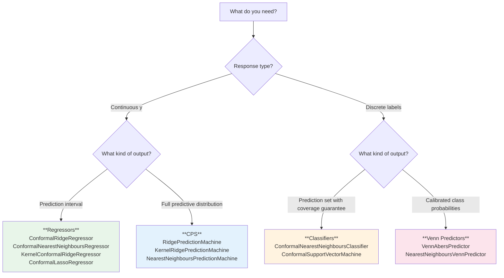

# Which Method Should I Use?

This guide helps you choose the right class from `online-cp` for your problem.
If you're new to conformal prediction, start with the [tutorial notebook](https://mybinder.org/v2/gh/egonmedhatten/online-cp/HEAD?urlpath=%2Fdoc%2Ftree%2Fnotebooks%2Ftutorial.ipynb) first.

---

## What output do you need?



!!! tip "Rule of thumb"
    - Need a **yes/no coverage guarantee**? → Regressors or Classifiers
    - Need to **make decisions under uncertainty**? → CPS (gives you the full distribution to optimise over)
    - Need **calibrated probabilities** for downstream scoring? → Venn predictors

---

## Regressors

All regressors produce `ConformalPredictionInterval` objects with guaranteed marginal coverage.

| Class | Complexity (per step) | Best when | Notes |
|-------|----------------------|-----------|-------|
| `ConformalRidgeRegressor` | $O(p^2)$ | Linear signal, moderate $p$ | Exact; fastest for $p \ll n$. Supports studentised residuals. |
| `KernelConformalRidgeRegressor` | $O(n^2)$ | Nonlinear signal, kernel trick | Exact; any kernel from `online_cp.kernels` or sklearn. |
| `ConformalNearestNeighboursRegressor` | $O(n)$ | Non-parametric, local patterns | Good default for tabular data. Custom distance metrics. |
| `ConformalLassoRegressor` | $O(np)$ | High-dimensional sparse signals | Homotopy-based; supports elastic net ($\rho > 0$). |

!!! note "Mondrian variants"
    Wrap any regressor in `MondrianConformalRegressor` for **group-conditional coverage** when you have a known categorical covariate (e.g., site, sensor type).

### Quick start

```python
from online_cp import ConformalRidgeRegressor

# Linear, fast, good default
model = ConformalRidgeRegressor(a=1.0)  # a = ridge parameter

# Nonlinear with Gaussian kernel
from online_cp import KernelConformalRidgeRegressor, GaussianKernel
model = KernelConformalRidgeRegressor(kernel=GaussianKernel(sigma=1.0), a=0.01)

# K-nearest neighbours
from online_cp import ConformalNearestNeighboursRegressor
model = ConformalNearestNeighboursRegressor(k=5)

# High-dimensional sparse
from online_cp import ConformalLassoRegressor
model = ConformalLassoRegressor(lam=0.1, autotune=True)
```

---

## Classifiers

All classifiers produce `ConformalPredictionSet` objects — sets of labels guaranteed to contain the true label with probability $\geq 1 - \varepsilon$.

| Class | Complexity (per step) | Best when | Notes |
|-------|----------------------|-----------|-------|
| `ConformalNearestNeighboursClassifier` | $O(n)$ | General purpose, any metric space | Default choice. Supports custom distance functions. |
| `ConformalSupportVectorMachine` | $O(n^2)$ in worst case | Kernel-based decision boundary | Uses SMO solver; powerful but slower. |

!!! note "Mondrian variants"
    Wrap in `MondrianConformalClassifier` for **label-conditional coverage** (validity within each class).

### Quick start

```python
from online_cp import ConformalNearestNeighboursClassifier

# Good default
model = ConformalNearestNeighboursClassifier(k=3)

# With SVM (kernel-based)
from online_cp import ConformalSupportVectorMachine, GaussianKernel
model = ConformalSupportVectorMachine(kernel=GaussianKernel(sigma=1.0), C=1.0)
```

---

## Conformal Predictive Systems (CPS)

CPS outputs a full **conformal predictive distribution** — a valid distribution function over $\mathbb{R}$ that you can query at any quantile, use for decision-making, or extract prediction intervals from.

| Class | Complexity (per step) | Best when | Notes |
|-------|----------------------|-----------|-------|
| `RidgePredictionMachine` | $O(p^2)$ | Linear signal | Same as Ridge regressor but outputs CPD |
| `KernelRidgePredictionMachine` | $O(n^2)$ | Nonlinear signal | Any kernel |
| `NearestNeighboursPredictionMachine` | $O(n)$ | Non-parametric | Based on k-NN residuals |
| `DempsterHillConformalPredictiveSystem` | $O(n)$ | No features (time series) | Label-only; Dempster-Hill construction |

!!! info "CPS vs Regressor"
    A CPS gives you **more information** — you get the full distribution, from which you can derive intervals at any level. Use a CPS when you need to:

    - Extract prediction sets at multiple $\varepsilon$ levels simultaneously
    - Make optimal decisions under a utility function
    - Visualise the predictive distribution
    - Score predictions with proper scoring rules (CRPS, log score)

    If you only need an interval at a fixed $\varepsilon$, a Regressor is simpler and equally valid.

### Quick start

```python
from online_cp import RidgePredictionMachine

cps = RidgePredictionMachine(a=1.0)
cps.learn_initial_training_set(X_train, y_train)

cpd = cps.predict(x_new)               # Returns a CPD object
interval = cpd.predict_set(tau=0.5, epsilon=0.1)  # Extract interval
```

---

## Venn Predictors

Venn predictors output **calibrated multi-probability predictions** — a family of probability distributions over the label space, one for each hypothesis about the true label.

| Class | Scorer | Best when | Notes |
|-------|--------|-----------|-------|
| `VennAbersPredictor` | `"ridge"` | Linear scoring, fast | Default for binary/multiclass |
| `VennAbersPredictor` | `"kernel_ridge"` | Nonlinear scoring | Requires a kernel |
| `VennAbersPredictor` | `"knn"` | Non-parametric scoring | Uses k-NN distances |
| `VennAbersPredictor` | `"svm"` | Kernel SVM scoring | Powerful but slower |
| `NearestNeighboursVennPredictor` | — | Simple k-NN taxonomy | Lightweight alternative |

!!! info "Venn vs Classifier"
    - A **conformal classifier** gives you a *set* of labels with a coverage guarantee.
    - A **Venn predictor** gives you *probabilities* for each label, with a calibration guarantee.

    Use Venn when you need **probability estimates** (e.g., for ranking, expected utility, or downstream models). Use a classifier when you need a hard **set-valued prediction** with coverage.

### Quick start

```python
from online_cp import VennAbersPredictor

# Default: ridge scoring, full (transductive) mode
vap = VennAbersPredictor(scorer="ridge", a=1.0)
vap.learn_initial_training_set(X_train, y_train)

pred = vap.predict(x_new)  # Returns VennPrediction
print(pred.p0, pred.p1)    # P(y=1) under each hypothesis (binary)
print(pred.point)          # Averaged point prediction
```

---

## Martingales & Change Detection

Conformal test martingales detect **violations of exchangeability** (distribution changes) online. The martingale value $M_n$ grows when the data distribution deviates from the calibration distribution.

### Which martingale?

| Class | Best when | Key idea |
|-------|-----------|----------|
| `PluginMartingale` | General purpose | Wraps any betting strategy with cautious-start mixing |
| `SimpleJumper` | Unknown alternative | Jumps between epsilon-experts; robust to different alternatives |
| `CompositeJumper` | Unknown alternative | Like SimpleJumper but also mixes over jump rates |
| `SleeperStayer` | Sudden change | Maintains sleeping/awake copies; resets after detection |
| `SleeperDrifter` | Gradual drift | Like SleeperStayer but forgets old data geometrically |
| `SimpleMixtureMartingale` | Conservative default | Uniform mixture over strategies; hard to beat in worst case |

### Which betting strategy?

Used inside `PluginMartingale` (or standalone):

| Strategy | Best when | Notes |
|----------|-----------|-------|
| `GaussianKDE` | General purpose | Default. Adaptive bandwidth, window option. |
| `BetaKernel` | General purpose | Better near boundaries of [0,1] |
| `BetaMLE` | Parametric alternative | Fits Beta distribution by MLE |
| `BetaMoments` | Fast parametric | Method-of-moments Beta fit |
| `ParticleFilterStrategy` | Non-stationary alternative | Adapts to changing distribution |
| `ExpertAggregationStrategy` | Want to combine experts | Exponential weights over a set of strategies |
| `FixedStrategy` | Known alternative | Supply your own pdf/cdf |
| `PiecewiseConstantBetting` | Simple bin-based | Histogram-like density on [0,1] |

### Which wrapper?

Wrappers convert a raw martingale into a **change-point detector** with a stopping rule:

| Wrapper | Detects | Threshold | Notes |
|---------|---------|-----------|-------|
| `VilleWrapper` | Change anywhere | $M_n \geq \lambda$ | Classical Ville's inequality. Simple, anytime-valid. |
| `CUSUMWrapper` | Change after unknown time | Page's CUSUM on $\log M$ | Lower detection delay post-change. |
| `ShiryaevRobertsWrapper` | Change after unknown time | SR statistic | Minimax optimal average detection delay (asymptotically). |

!!! tip "Default recommendation"
    Start with `PluginMartingale(GaussianKDE)` wrapped in `VilleWrapper(threshold=20)`. This is robust, simple, and corresponds to a Bayes factor of 20 against exchangeability.

### Quick start

```python
from online_cp import (
    PluginMartingale, GaussianKDE, SimpleJumper,
    VilleWrapper, CUSUMWrapper
)

# Default: plugin with Gaussian KDE
mart = PluginMartingale(betting_strategy=GaussianKDE, min_sample_size=50)

# Or use a jumper (no tuning needed)
mart = SimpleJumper(J=0.01)

# Wrap for detection
detector = VilleWrapper(mart, threshold=20)

# Feed p-values one at a time
for p in p_values:
    detector.update(p)
    if detector.M >= detector.threshold:
        print("Change detected!")
        break
```

---

## Mondrian Conformal Prediction

Use Mondrian CP when you need validity guarantees **within subgroups**, not just overall.

### Label-conditional (classification)

The most common case: guarantee coverage **per class** — $P(y \in \Gamma(x) \mid y = c) \geq 1 - \varepsilon$ for all $c$ (ALRW2 §4.6.7).

```python
from online_cp import ConformalNearestNeighboursClassifier
from online_cp.mondrian import MondrianConformalClassifier

model = MondrianConformalClassifier(
    base_model=ConformalNearestNeighboursClassifier(k=5),
    category_fn="label",
)
model.learn_initial_training_set(X, y)
Gamma = model.predict(x_new, epsilon=0.1)
```

### Object-conditional (regression or classification)

When you have a **categorical covariate** (site, sensor, group) and want group-conditional validity:

```python
from online_cp import ConformalRidgeRegressor
from online_cp.mondrian import MondrianConformalRegressor

base = ConformalRidgeRegressor(a=1.0)
model = MondrianConformalRegressor(base, category_fn=lambda x: int(x[0] > 0))

model.learn_initial_training_set(X, y)
interval = model.predict(x_new, epsilon=0.1)
```

### General taxonomy

For any taxonomy $\kappa(x, y) \to \text{category}$ depending on both features and label:

```python
MondrianConformalClassifier(
    base_model=ConformalNearestNeighboursClassifier(k=5),
    category_fn=lambda x, y: (y, int(x[0] > 0)),  # cross label × feature group
)
```

!!! warning "When NOT to use Mondrian"
    - If your categories are very small → insufficient calibration data per group
    - If category membership is unknown at test time (not applicable to label-conditional)
    - If you want marginal (overall) coverage only → standard CP is simpler and tighter

---

## Pipelines

A `Pipeline` chains one or more feature transformers before a conformal predictor, exposing exactly the same `learn_initial_training_set` / `learn_one` / `predict` API so the composed object drops straight into `progressive_val` unchanged.

```python
from online_cp import (
    Pipeline, StandardScaler, FuncTransformer,
    Select, Discard, TransformerUnion,
    ConformalRidgeRegressor,
)
import numpy as np

# Freeze-scale then predict — training-conditional validity (ALRW2 §4.7)
pipe = StandardScaler() | ConformalRidgeRegressor(a=1.0, epsilon=0.1)

# Fixed map (always safe, exchangeability trivially preserved)
pipe = FuncTransformer(np.log1p) | ConformalRidgeRegressor(a=1.0, epsilon=0.1)

# Bare callables are auto-wrapped in FuncTransformer
pipe = Pipeline(np.abs, ConformalRidgeRegressor(a=1.0, epsilon=0.1))

# Keep only columns 0 and 2
pipe = Select([0, 2]) | ConformalRidgeRegressor(a=1.0, epsilon=0.1)

# Drop noisy column 3
pipe = Discard([3]) | ConformalRidgeRegressor(a=1.0, epsilon=0.1)

# Concatenate two feature views (original + absolute value)
union = FuncTransformer(lambda x: x) + FuncTransformer(np.abs)
pipe = union | ConformalRidgeRegressor(a=1.0, epsilon=0.1)

# Chain multiple transformers
pipe = Pipeline(
    Select([0, 1, 2]),
    StandardScaler(),
    FuncTransformer(np.tanh),
    ConformalRidgeRegressor(a=1.0, epsilon=0.1),
)

pipe.learn_initial_training_set(X_train, y_train)
interval = pipe.predict(x_new, epsilon=0.1)   # same API as a bare predictor
```

### Transformer modes and validity

| Mode | Example | Conformal guarantee | Cost |
|------|---------|-------------------|------|
| `"fixed"` | `FuncTransformer`, `Select`, `Discard` | Full exchangeability — always valid | O(1) |
| `"frozen"` | `StandardScaler()`, `MinMaxScaler()` | Training-conditional validity (ALRW2 §4.7) | O(1) |
| `"bag"` | `StandardScaler(mode="bag")`, `MinMaxScaler(mode="bag")` | **Exact finite-sample validity** — no warm-up required | O(n·d²+d³) per predict |

The pipeline raises a `ValueError` at construction if any transformer's mode is not in `{"fixed", "frozen", "bag"}`.
Pass `unsafe_incremental=True` to opt out (this voids the finite-sample guarantee).

**Bag mode** (`mode="bag"`) refits the scaler at each prediction on the full augmented
*object* bag `[X_train, x_test]` (label-free, symmetric → permutation-equivariant).
This gives exact finite-sample validity with no required initial training set, and adapts
naturally to distributional drift. The trade-off is losing the Sherman-Morrison incremental
update, making the cost O(n·d²+d³) per `predict` call (O(n²) over a stream of n points).

```python
# Bag-fit: exact validity, no warm-up required, drift-adaptive
pipe = StandardScaler(mode="bag") | ConformalRidgeRegressor(a=1.0, epsilon=0.1)

# Start with just learn_one — no learn_initial_training_set needed
for x, y in stream:
    interval = pipe.predict(x, epsilon=0.1)   # full-label-space until bag grows
    pipe.learn_one(x, y)
```

Mixing `"frozen"` and `"bag"` transformers in the same pipeline is rejected (v1).

### Inspecting a pipeline

```python
pipe.summary()
# {'n_steps': 2,
#  'transformers': [{'type': 'StandardScaler', 'mode': 'frozen', 'fitted': True}],
#  'estimator': {'type': 'ConformalRidgeRegressor'},
#  'unsafe_incremental': False}
```

---

## Summary Decision Table

| I want... | Use | Class |
|-----------|-----|-------|
| Preprocessing before conformal prediction | Pipeline | `Pipeline` / `StandardScaler` / `FuncTransformer` |
| Prediction interval (linear) | Regressor | `ConformalRidgeRegressor` |
| Prediction interval (nonlinear) | Regressor | `KernelConformalRidgeRegressor` or `ConformalNearestNeighboursRegressor` |
| Prediction interval (sparse) | Regressor | `ConformalLassoRegressor` |
| Prediction set (classification) | Classifier | `ConformalNearestNeighboursClassifier` |
| Full predictive distribution | CPS | `RidgePredictionMachine` |
| Calibrated probabilities | Venn | `VennAbersPredictor` |
| Change-point detection | Martingale | `PluginMartingale` + `VilleWrapper` |
| Group-conditional coverage | Mondrian | `MondrianConformalRegressor` / `MondrianConformalClassifier` |
| Label-conditional coverage | Mondrian | `MondrianConformalClassifier(category_fn="label")` |
